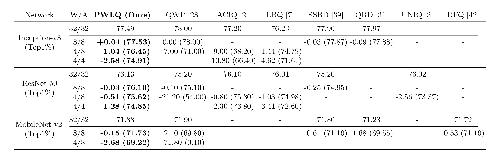

# PWLQ

**Updates** 

2020/07/16 - We are working on getting permission from our institution to release our source code. We will release it once we are granted approval.

2020/08/24 - Code released.

---

PyTorch Code for our paper at ECCV 2020 (**oral** presentation): **Post-Training Piecewise Linear Quantization for Deep Neural Networks** [[Paper]](https://github.com/jun-fang/PWLQ/blob/master/paper/2949.pdf) [[arXiv]](https://arxiv.org/abs/2002.00104) 

By Jun Fang, Ali Shafiee, Hamzah Abdel-Aziz, David Thorsley, Georgios Georgiadis, Joseph Hassoun

- **Approach**

<div align="center">
   
</div>

- **Performance**

<div align="center">
   
</div>

<div align="center">
   
</div>

### Requirements
The code was verified on Python-3.6+, PyTorch-1.2+.

### Usage
Check PWLQ at `quant/pwlq.py`.

Run `bash eval.sh` to evaluate PWLQ on ImageNet. Results would be recorded at `results/*.csv`. 

Results might be slightly different due to the `randomness` of calibration samples for activation ranges.


## Citation

We appreciate it if you would please cite our paper:

```
@inproceedings{pwlq,
  title={Post-Training Piecewise Linear Quantization for Deep Neural Networks},
  author={Fang, Jun and Shafiee, Ali and Abdel-Aziz, Hamzah and Thorsley, David and Georgiadis, Georgios and Hassoun, Joseph},
  booktitle={ECCV},
  year={2020}
}
```
