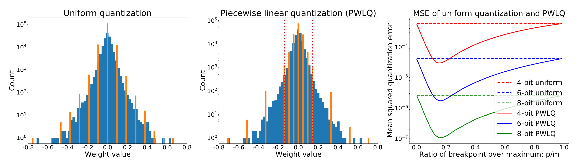
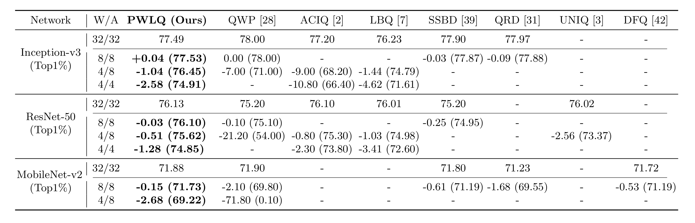

# PWLQ

**Updates** 

2020/07/16 - We are working on getting permission from our institution to release our source code. We will release it once we are granted approval.

---

Code for our paper at ECCV 2020 (**oral** presentation): **Post-Training Piecewise Linear Quantization for Deep Neural Networks** [[Paper]](https://github.com/jun-fang/PWLQ/blob/master/2949.pdf) [[arXiv]](https://arxiv.org/abs/2002.00104) 

By Jun Fang, Ali Shafiee, Hamzah Abdel-Aziz, David Thorsley, Georgios Georgiadis, Joseph Hassoun

- **Approach**

   

- **Performance**

   

## Citation

We appreciate it if you would please cite our paper if you found it useful for your work:

Fang, J., Shafiee, A., Abdel-Aziz, H., Thorsley, D., Georgiadis, G. and Hassoun, J.: *Post-Training Piecewise Linear Quantization for Deep Neural Networks*, ECCV 2020.
